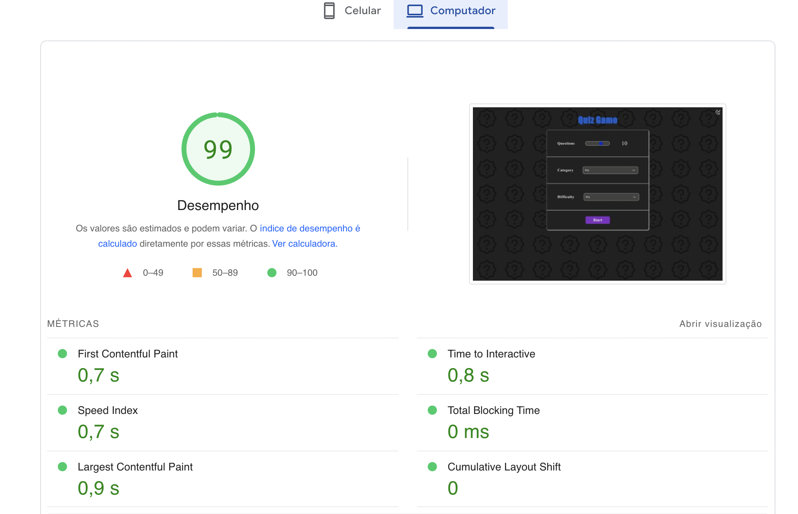
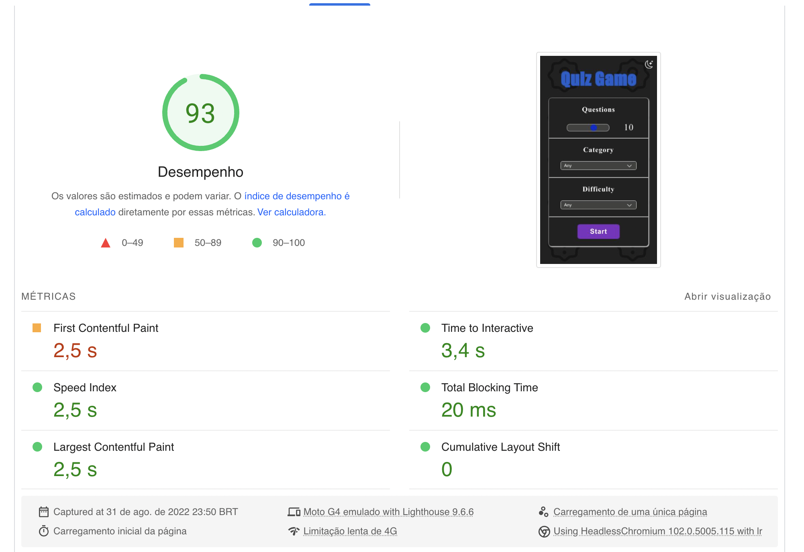

# 🕹️ Quiz Game

This is a quiz game made by using the following technologies:

#### `React`

#### `TypeScript`

#### `Styled Components`

#### `React Spring`

🚀 Checkout the [live project](https://react-quiz-game-tdb.netlify.app/)

# 🤾 State Management

The state management relies on the usage of `useReducer` and `Context API`

The useReducer function and state are passed through the whole application components by the Context Provider.

In order to get the reducer function or state inside a component we need to:

```javascript
const { state, dispatch } = useContext(ReducerContext);
```

## 📖 Data

All the project's data is provided by the [Open Trivia Database API](https://opentdb.com/api_config.php).

## 🗂️ Directory Organization:

The project `src` contains three folders

1. <strong>Components</strong>: stores all the components used in the application excepct for the Reducer Provider, which is a high level component that wrappes the whole application. Contains subfolders related to each user experience step, like `configuring`, `playing`, `analyzing results`

2. <strong>Services</strong>: custom hooks and browser APIs classes (ease the usage of local storage and cookies).

3. <strong>Utils</strong>: contains the files related to theming, global style, types, enums and a custom hook to check wheter the user is acessing by a mobile device or not.

## ⚡ Performance

The following measures were taken in order to increase performance:

1. preload external css fonts
2. lazy loading main React components (configuring game, playing and results)
3. optimize analytics tools (less is more)




